# Project1_DC_Crime_Analysis

## Objectives:

1. To get familiar with Data Analysis using python pandas, numpy and matplot libraries.
2. Find patterns and trends to understand the safety level and types of crimes that occur in different areas in Washington D.C
3. To shine a light on criminal activity and provide insight into the safety of the county's capital city

## Team Members:
Lolita Dias, Irais Garcia, Marc Omar Haddid, Nithin Sunil

## Dataset:
We choose to analyse Washington crime rate between 2009 - 2019.
The data set was downloaded from Kaggle

## About the dataset:

Dataset of all of the crimes in the DC metro police system ranging from Theft, Arson, Assault, Homicide, Sex Abuse, Robbery, and Burglary.Data can be easily geocoded and mapped, trends can be extracted, and predictions can be made.

Raw Data can be accessed from: http://crimemap.dc.gov/CrimeMapSearch.aspx#tabs-GeoOther

The data is most easily accessed by downloading 1 ward at a time for the specific data range.

## Tasks:

Created scripts to analyse the crime data and answer the following questions:

1. Outliers in the dataset.
2. Total number of crimes for each category of offense
3. Percentage of crimes for each category of offense
4. Total Number of Crimes by Year
5. Total Number of Crimes by Month
6. Total Number of Crimes by Day of the Week
7. Total Number of Crimes by District
8. Total Number of Crimes by Shift
9. Analyze the crime trends for all the offenses from 2009-2019
10. Identify the dangerous blocks of Washington D.C

## Approach

Step 1: Import Dependencies

Step 2: Read the csv files and convert them into DataFrames

Step 3: Merge all the csv files from 2009-2019 into a single file and a single DataFrame

Step 4: Data Profiling and Data Cleansing

Step 5: Identify and delete Duplicate records

Step 6: Identify Outliers

Step 7: Analyzing the Crime rates

## Results:
1. Outliers in the dataset.

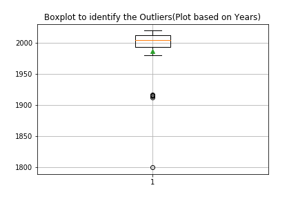

Observations: 
There are incidents with a start_date in the years 1800 1912 1914 1915 1916. 
Are these start dates in error or were these unsolved crimes recently solved through new technology advancements?
Is it truly a 100-year-old cold case, or did the person simply enter the wrong date?

For our analysis, we will be deleting the data in the lower quartiles

2. Total number of crimes for each category of offense

3. Percentage of crimes for each category of offense

4. Total Number of Crimes by Year

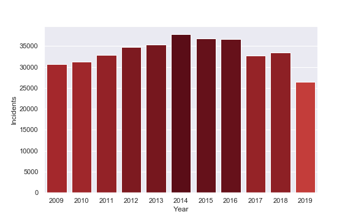

5. Total Number of Crimes by Month

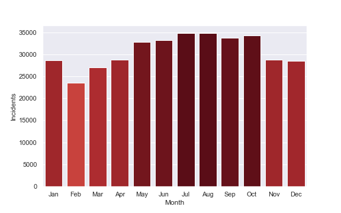

6. Total Number of Crimes by Day of the Week

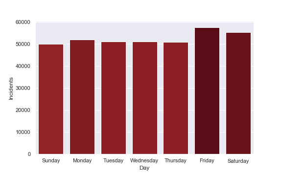

7. Total Number of Crimes by District

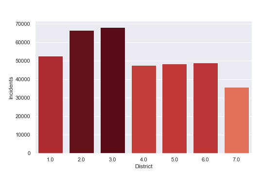

8. Total Number of Crimes by Shift

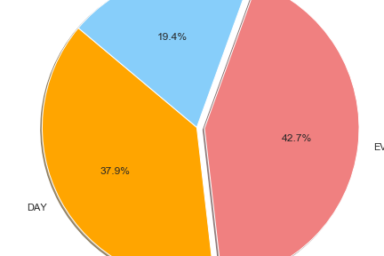

9. Trends for all the offenses from 2009-2019

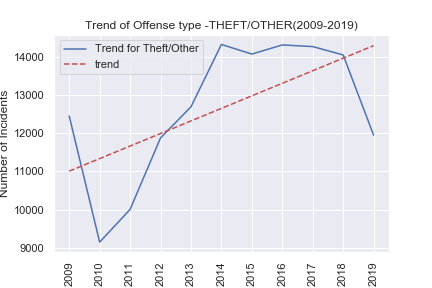

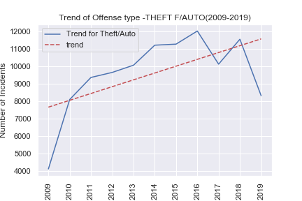

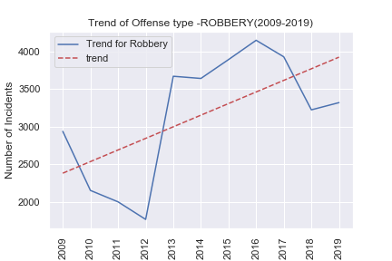

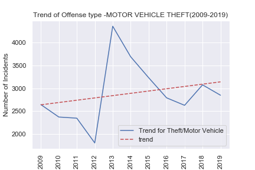

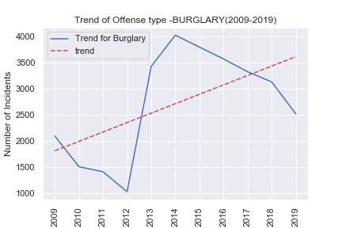

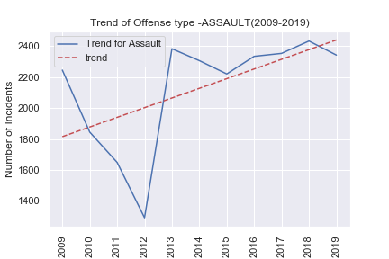

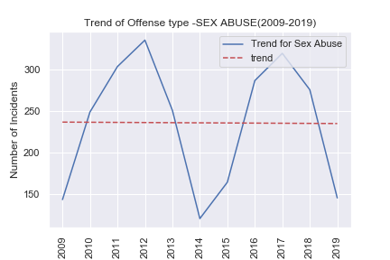

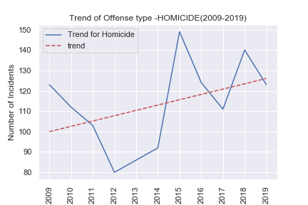

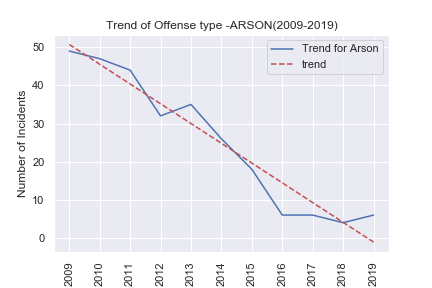

10. Dangerous blocks of Washington D.C

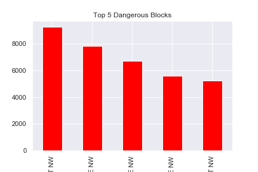

11. Average number of Crimes per Day

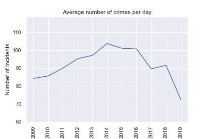

12. Crime Map for Washington D.C

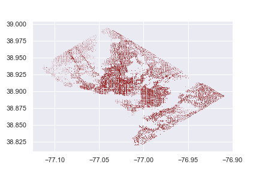

